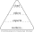

*The only thing to fear is ourselves... in most of our lives a temptation of personal greatness has been suggested.* *Civilization is only good behavior.* 

# How the Judeo-Christian System Influences Civilization (Part 1) http://tinyurl.com/HJCR1 https://bit.ly/HJCSIC

Civilization began as a natural order. This changed when the Judeo-Christian system started. Civilization moved from evolution (natural whims) to belonging to those who join a predesigned system---the people that know the details of the system get the rewards. The Jews started the system and it comes from their "Secret of Heaven". The "Secret of Heaven" leads them to push on civilization a dualistic system (primary/secondary, male/female, reap/sow...). It is implemented by rewarding a single group solely for an era of fifty years then rewarding a second group for an era of fifty years. The first group the Jews reward for *reaping* acts (i.e. taking, usually men). For the next fifty years the Jews reward the second group for *sowing* acts (i.e. making things grow [giving], women and their protected). They keep the entire system through all of time silent. As a result of the alternating support and silence much confusion is caused. The people who become desperate and react selfishly the Jews reward (*drol and dog*). 
The first group becomes so rewarded that they draw the second group's focus even to ire. The confusion-magnetization/spellboundness/misdirection lulls them into being spoon-fed what the rewards are. The rewards come silently from the Jews and are done largely by discriminating against the third group using the Hebrew Code.
So rewarded does the first group become that the second group gets angry and fail to realize that they are spoon-fed what the rewards are. These rewards come mostly through using the Hebrew Code to define the third group, the people with little knowledge of the first group, as negligible. The Christian church (a succession of the second group) largely practices their beliefs with spiritual principles but is built upon a female leadership (formed with the New Testament) which gets safety with the Jews by *giving* them things, particularly people. The Jew maintain the system like a vital job. From it they get: physical protection (in the first fifty years), trust (in the second fifty years), and through it all authority and wealth. Their definition of it is literally *heaven*. Any person that uses the system is likelier to have a successful life and likelier to keep heaven silent. I have yet to find anyone who has any sufficient overview of what is happening. This system has effected civilization around the world. •••*accuse-follow/trick-guile*•••

## Who I Am

I am a person that got used as a sacrifice from an early age. People have learned to treat me differently so that they could get protection themselves. This has been come done so much that it has removed me from civilization. I learned what I know now by accepting truths that were hard, where I had to look at improbable answers to try to survive when life became too impossible to live reasonably anymore. There are other people are included besides me, we would appreciate any help.

## Research Sources

The research for this paper is generally from the Bible. The Bible, the most read book in the world, is where the Judeo-Christian system documents its intent. Institutions that have been around awhile usually provide a plan and both the Jews and the Christians have described their plans in their Testaments. The Jews have spent much time hiding their secrets and refining the Bible because their system has been so profitable to them. The Bible contains many schemes and its attitude can be intimidating. Its audaciousness and graphicness can contain meanings that are meant to be understood only by those who have great health (from supernatural safety). When, though, one understands the intent of the Bible it helps decipher how this system influences civilization. Those that are a part of the system project the Testaments as fair declarations with civilization. However, to say it is a sufficient declaration is false. Because the Bible only tells part of the "Secret of Heaven", is intentionally cryptic, and uses graphicness to portray content it is below necessary[^Judeo-Christian-Definition].

A few things to know: The Bible is written revisionistically[^definition-revisionistic] (backwritten) to make newer rules apply throughout, the beginning of the Bible is packed with details, and the Bible is the beginning of the female side of the story (except for Genesis 1), the story of amassing male sacrifices.

## Hebrew Code

The Hebrew people use a code to share secrets with. It is hidden within ordinary language. The base meanings have *absolute* definitions.

## The Secret of Heaven

The "Secret of Heaven" comes from before the Bible was written. The chance of understanding the Bible absent of knowing the "Secret of Heaven" is very small. How the "Secret of Heaven" was formed is part speculation, it is derived from my experience and my limited reading of *History of Egypt, Chaldea, Syria, Babylonia, and Assyria, Volume 3*[^HECSBAV3].

The Secret of Heaven started because of an environmental threat. The area the system started in was the Tigris-Euphrates rivers of present-day Iraq around 4100 years ago. This is where Abraham came from (Gen 11:28-31). The area is surrounded by a lot of desert. Because surviving in the area was sometimes risky (droughts, distance from safe land...) it could create desperate men. The residents became afraid of the desperate men's mood when their behavior became visceral[^definition-visceral]. Someone doing better (the ancient Hebrew) thought a desperate person particularly dangerous but decided to reward him for personal protection. He kept it silent because the desperate person's behavior effected others adversely. The desperate person felt a life-debt and protected his underwriter even beyond ethical boundaries. The ancient Hebrew decided to keep on rewarding him for these desperate acts. He felt very *intelligent*. The desperate man became more *visceral*---it grew to a feeling of being open-bounded, built to narcissism, then he became strong enough to define what "good"[^definition-good] was, lastly an insularity can build where abnormal experiences are required for him to find things interesting. These were men to be feared. Both men prospered from this, a feeling of obtaining *free* began. Other men that were doing well began to catch on. Silently, it spread in the area. The relationship between *intelligent* man and *visceral* man formed a symbiotic bond that came to be known as the "Secret of Heaven". The great Jewish two system was born. In Genesis 2 it **doubles** again.

Harsh land, a few fortunate. One rich, another fighting for his life. The rich man sees a desperate man **sin** (e.g. steal some seeds). He confronts him and decides to avoid arguing with someone who is trying to save his life. The rich man knowing that even his fortune can be effected by the environment says to himself, "This would be a great person to have on my side." So, instead, he rewards him for the sin (e.g. allows him to use some irrigation water). Afterward, he decides to reward other sins of his (that can be gotten away with) as well. The desperate man became big and powerful, someone to be feared. By rewarding him, the rich man was able to create <ul>policy</ul>. It turns out that supplementing the basic male trait (men liking taking) influenced male behavior in the area. This **encouraged** other fortunate men to reward likewise and an infestation of male-taking began. It lasted a long time.

## Bible Translation

**Genesis 1** *(Primary, Male-Policy, Reap)* Heaven originally was an all-male institution. It lasted a long time and Genesis 1 covers it all---in one giant swath. To the Hebrews, men by *taking*, for themselves, create good. A rewarded desperate-man *took* so much that the Hebrews refer to him as a "God", "In the beginning *God* created the **heavens** and the **earth**" (Gen 1:1 NIV). Heaven was such an attraction it became systematic. A man would double a previous desperate man's sin and change one facet of it: day/night, water/sky, land/sea, sun/moon, **man/nature**. The effect it had on nature was large. ••more "good and evil"[^definition-good] was done••

**Genesis 2** But men taking all the time and being completely secretive caused a serious problem: heaven became obvious. So the women (the wives... of the noble men) caused a stir.

**Genesis 2** *(Secondary, Female-Policy, Sow)* "By the **seventh** day God had finished the work... so on the **seventh** day he rested from all his work." (Gen 2:2). Something is different here. Resting. Seventh. Genesis 2 starts off with the LORD ♀. Yep, *she*[^pronoun-female] contends the creator of plants, formed man. This doubling (Gen 2:5-7 from Gen 1:27-29) means there is a new leader in town. To the quick: there is a problem with the all-male heaven. Men reaping all the time causes a lot of butting heads... heaven becoming obvious. So a noble female (likely a wife of a god) sees how the mortal females have become desperate and talks to the serpent[^serpent]. The idea she sold him on was: that they could take a desperate man's wife and get her (Eve here) to enforce policy through him. The males had their chance and to make someone else do it provided better protection. He agreed... ~~found it hard to argue with the raw mortal energy~~. Adam, a sprouting male god, is controllable. The LORD grooms him, gives him a farm---it makes him feel confident like a god. Gives him a wife (finds someone willing to steer him). Adam and Eve were still of nature though "naked and they felt no shame". Key word: **Eden** (2:8).

**Genesis 3** *(~~Primary,~~ Secondary, Male-Female-Policy, Reap)* In ancient Hebrew history the power structure is thus: there are a bunch of Desperates/Nobles; their Rewarders who like to keep very silent (If I remember correctly they are represented as a single entity, who they called Ea, later Hea [which is how heaven got its name]); and the Nine who would be like a mayor today---he got to decide who the nobles were (by creating floods [selfish spats] when was told were necessary). So the serpent (very powerful at the time) who has already decided to try female-policy, tempts Eve into taking the fruit (the polar/opposite of what the female LORD is allowed to do... the great Jewish two system). A god enactment is done by Eve recognizing the tree to be "good for food and pleasing to the eye" (Genesis 3:6 doubles Genesis 2:9); she sins by partaking of the fruit to "be like God" and because it is "desirable for gaining wisdom". She also gives some to Adam. They become above nature: "realized they were naked". The woman LORD chews them out (double-talk [saying one thing buy meaning the opposite]: congratulates them): the serpent (praise be him for our nobility) is to be above everybody; the enmity between the serpent and the woman LORD really means that they will be good friends; the female gods (like Eve) will rule over their husbands; the man will enjoy life and be lazy (will probably represent us too [kind of had to as the male gods generally think that only men rule]), and Adam just a bumbling follower must be kept from returning to Eden (Gen 3:22), protected by "cherubim and flaming swords" (akin to sons and daughters of Genesis 6:2, people to be feared). ••"Gaining wisdom" is (hu)man over nature, intellect or **visceral-ness**, safety solely by thinking (with the predesigned system)---a luxury for any animal. The reaping renews again when Eve then Adam partake of the fruit. The Hebrews to keep prosperous the using of naive people, refer to the people of Eden almost silently. Key words: dust, dust, dust (14, 19).••

---

**Genesis 4** *(Secondary, Female, Sow)* Some people have created a female god. Eve is the "LORD" here. Cain, Abel, and Seth are probably associates of Eve rather than her kin (kin usually get heavenly inclusion). Cain and Abel try to bribe Eve with "fruits" and "fat-portions" so that they can get to heaven (fat-portions probably wins because it is something other than the fruit like of the tree of good and evil). "Do what is right (3:7)" means to win, and "sin is crouching at your door" means to be wary of nature, "you must rule over it". The line that "Cain attacked his brother Abel and killed him" is a fooling, a trick. It says that those with Eve/LORD will emphasize the later definition (e.g. "brothers keeper")[^Story-of-the-Moral]. She too curses her male subjects (doubles the action... takes out the cursing) and still gets to "save" them *from Eden* (Gen 3:14-19). She also gives Cain protection, "... anyone who kills Cain will suffer vengeance **seven** times over". Cain followed the directive where the god before put "cherubim and a flaming sword" and went around to the "east of Eden" (to the new heaven on the right).  Lamech doubles the seven because he sees the trick, but something happened before:

**Genesis 5** *(Some Rule Eden, Generally Female Policy)*: A time span of ten male rulers from Adam to Noah is defined. ~~The "E" is kept so silent that the reapers accept ENOSH as leader?!~~ When the females get their era back they put a reaper god there to rule... within female policy. Two more eras happen (Mahalalel and Jared) then Enoch rules in another male era (even more Edenish) and the reapers figure it out, "God took him [Enoch] away (Gen 5:25)." An Eden ruler Methuselah  rules the female era, then the reapers put in a female-appointed god (Lamech). Then Noah comes, the avenging angel. Lamech proclaims that Noah is to restore god rule that Adam's weak, female appointed rule, lost, "[Noah] will comfort us in the labor and painful toil of our hands caused by the ground the LORD has cursed (references Gen 3:17)."

**Genesis 6** *(She Said but a dual-power to restore heaven)*: Attack on Eden begins. God pronounces a dual-power, "a hundred and twenty years." The "sons of God" (female leaders) sucked up the pride in their own god-ness and mated with the "daughters of humans" (desperate men, angels). This created Nephilim---people that are physical giants, knowing little borders, people to be feared---to create heaven again. The Lord (a female god here) is upset because civilization is co-operative and thoughtful ("wickedness... [and] evil" Gen 6:5) and wants to restore the gods to power. She uses Eden's name (3,5,6) to set-up the exercising of god power, "The ark is to be *three* hundred cubits long, *fifty* cubits wide and *thirty* cubits high. (Gen 6:15).

**Genesis 7** *(He Said, Business, Partisanship)*: (`The flood is rewarding, in synchronicity, a large number of *desperate* men to create "heaven on earth", partisanship, creating good and evil. [^flood]`.) The Lord found Noah "righteous" (godly) and he flooded the *earth*, put a*n*imals on the Ark, to restore the gods to power. More using Eden's name for god power, "Noah was six hundred years old...", etc.. (`"The waters flooded the earth for a hundred and fifty days (Gen 6:24)" is used in modern times to denote yearly floods from to January 1 to May 31 (absent a leap year)`).

---

* Double and get higher.
* When god's behavior becomes extreme the Hebrews tell people to "Fear God".
* The serpent encouraged selfishness.
* The Jews try to make their history look planned here, but the truth is since the Jews keep heaven [the great Jewish two system] always silent, a progressive confusion begins early on the second group. The confusion has created a path for people that start near-sighted and ignorant of complicity but become desperate---a staging heaven to Judaism.
* Became eventually: The women are going to flood too and do it better.
* This directive (Gen 3:22) will develop to: that to become a god a person must do a sin that is unforgivable within civilization to get "saved"... it keeps them silent.
* [^flood]
* "friends (Job 2:11)"
* (narcisstic, desperate)
* it hides the flood
* the right: the enablers, the finger-waggers
* quotes as " or ' rather than ’ and ” ?!
* Verbatim Character in templates fix.
* favoring or divining?? divisive, partisian?
* first-group (that sometimes get identified as the Jews)
* plausible deniability
* follow/trick

## Books that Help

  * 48: An Experiential Memoir on Homelessness                                      Sheldon A. Jacobs
  * Cary Grant: A Biography                                                         Marc Eliot
  * Friends, Lovers, and the Big Terrible Thing: A Memoir                           Matthew Perry
  * History of Egypt, Chaldea, Syria, Babylonia, and Assyria, Volume 3[^HECSBAV3]   Gaston Maspero
  * Inside Out                                                                      Demi Moore
  * Mission of Mercy: Allowing God to Use YOU to Make a Difference in Others        Nancy Alcorn
  * My Days                                                                         Marion Ross
  * The Beauty of Living Twice                                                      Sharon Stone
  * The Greater Journey: Americans in Paris                                         David McCullough
  * The Last Commissioner: A Baseball Valentine                                     Fay Vincent
  * Think Again                                                                     Diane Keaton
  * ZEALOT: The Life and Times of Jesus of Nazareth                                 Reza Aslan
  * Marlon Brando
  * Clark Gable

## The Story of the Moral

*Where are the people who feel feel responsible for what is now a genocide?* First, any creature has evolved to think in only *one* reality. The great Jewish two system confuses the mind of those less safe. Second, since most people are ignorantly rewarded by the two system in the environment those that know anything are directed by the Jews (Angels?) to hate the Jews (get incited might be a better way to put it) rather than to look at themselves for their own complicity. The third group is often too confused (by the two system) and busy (repairing their lives) to try and assemble an accusation.

* If we fail to go through it together, evolve together, the revolutions continue. These Jobisms truly only help those that do them. Right: forcing their way in. **Socially necessary information** never again *cycle of poverty*.
* 50 years right has always thought that giving to left will reach satiation ([American Made](https://www.imdb.com/title/tt3532216/))
* Creating gods -- He and She God competition, battle of the fatfaces, good for the people that are part of the battle.
* Vegetarian importance---odd to the new---respect for all life can get us to Eden again.
* complicit
* A desperate man being constantly rewarded builds in time an insularity where more abnormal feelings are required for him to find things interesting. And from this insularity his behavior begins to wear on civilization's standards. He becomes so immobile that when the Hebrews say to "fear God"... this is what they mean.
* Turns out to be a selfish splitting by both groups of heaven.
* (Reaping/Sowing explained: By nature a small part of man gathers food while his wife is with child; and a small part of woman tends to the child---these hormones in large doses... godly.)

* confuses

## Notes

+ [MS Word---Improving the Bottom Line](http://wordfaqs.ssbarnhill.com/BottomLine.htm)
+ * “ ‘ ’ ” convert to " and ' as pandoc does so already.
+ SVG_EOC: domain-Seven: name outlines to fonts.
+ Mass Societal Guilt Avoidance
  - Mass Societal Psychlogical Pressure/Reinforcment
+ Zero-sum game and John Nash add.
+ What is heaven? It has come to following the free---a gravity almost all are being pulled to---generally ignorantly. A safety. Can anyone see it clearly.
+ The saved, the right, feel it is more about fighting or avoiding the Jews than listening to the to the people that need it the most.
+ Grand Mistresses/Masters say "It hardly matters how you get here".
+ Those that follow the great two-ism live rich lives---an algorithm invested in heavily by both groups---the great two algorithmic clock.
+ Some people join these societies thinking they will help from there---going through it together is nature's answer.
+ *Satan says, "It is easy to get people to be selfish." (Job ??:??)*
+ Answers that come from the top/heaven/the-gods provide success/safety in the immediacy rather than knowledge that is built naturally/socially over time---the consequences in the future are huge.
+ Heaven is a Pavlovian system that is running away from nature. The rewards outweigh the known/felt consequences.
+ Esther: Where is the five discriminating?
+ Gods invest in two; Edenites invest in one (nature).
+ Heavenly Sins: 1) Protecting gods first and answers come from the saved; ~~2) Disappearing as an answer~~; 3) Eden as expendable/erasable and 4) Beauty having value.
+ Eight abandoned by Jews, now a red herring. The right has claimed it as theirs (7) and hides behind it. Combative right also using it to label Jewish things with (businesses, etc.). It lacks being fair because they have more numbers.
+ ~~Bad behavior feeds them!~~ There is only good behavior. Only good behavior makes civilization.
+ Paradise Lost---:(.
+ ♪ Do I need your civil war? It feeds the rich while it buries the poor. ♪
+ Empathy: sharing a similar feeling because of a similar threat.
+ Saved-people/gods... your perspective is going to make you divine simply by position. By default we want to be righteous, good with nature and others—--only an equal perspective can accomplish that. To help, perspectives like "beauty" and "being saved" need to be left behind.
+ From an honest perspective it is easier to learn that hardness and softness are hardly male and female attributes. Really, they are because the first group (the Jews) got to exercise the Secret of Heaven (and flood) and felt its production and protection (fought and divined); while the second group inherited the protection and were given an age of rest.
+ Safety (as in from heaven, a perspective above nature) breeds conservativeness. Both the Jews and the Right behave so. This conservativeness abandons the people in Eden and puts them in greater danger.
+ If we do a thing that fails to prioritize those that need it the most civilizations (herds) make us feel guilty. Survival requires us to move together as one.
+ We have to go through evolution all together else we will become ignorant of the people left behind.
+ Deperates, How Did They Become So? They need confidence so much and focus entirely on themselves (narcissistic/self-absorbed)---other needs they fail to recognize.
+ Seeing Edenites, naive people, gets the angels excited, and the Jews a feeling of free. Edenites have closer ties to nature and are kept from knowing that others have chosen "heaven on earth" (whether right or left) to get themselves above them. The first group/gods divine and put Edenites in a lower class during the flood, the second group/gods largely ignore them or sin against the Edenites as an offering to regain control after the flood (oops). The second group lacking knowing the great two-ism put us Edenites in increasingly worse danger. Such naivete of the Edenites got the Jews [confident] in such a way that these bugs were built in 1968! The angels/beauties are Pavlonian, guided by many of their era's rewards. The only answer is to keep from feeding them and reward where earned. We Edenites would really appreciate it (♥ free will).
+ The New Testament occurred at a time of a lot of turmoil (the Roman occupation, another flood). Many messiahs were created (Zealot: The Life and Times of Jesus of Nazareth, Reza Aslan)---Paul being the foremost, as a baby! (i.e. Paul was likely the lead person they used to create the "How to Deal with Messiahs/Jesus" policy.) Paul choose to avoid heaven I believe (e.g. the three temptations in the wilderness [MT 4:1-11, Luke 4:1-13]) and stayed a part of Eden a good part of his life---even during the "golden age" (in Zealot). The second group had to deal with Paul, his ethics, and it would have been work for them. This [closed the gap] in the Jewish dualism that took 400 years to find an amendable policy---the New Testament, the Christian Church, which agreed to act on people like Paul. The policy: gave fealty to the Jews (MT 1), agreed to provide sacrifices (with some being babies) (MT 2:1-4); and said that those that believe in Jesus (and people like Paul) as sacrifices were absolved of sin. Jerusalem got renamed Aelia Capitolina as part of the turmoil. (This is important history that few know.)
+ The result of the second group fifty-year rule ends up making [laypeople] who have little heavenly knowledge, are naïve, and are exploitable/susceptible. Then the whole cycle is restarted again where the first group *rewardees* are excited by the naïveté of the [laypeople] who are often taken advantage of and used as tools in this battle. I am older and have seen a large number of poor people being used as them---the prescribed fix is false and selfish.
+ The thing to do today is help Job. Help him get a meal... The priority is to help the people that need it the most! Thinking the golden age is yours or being upset with the Jews *are distractions*. To help the people that need it the most is **hard**. We have absconded much! The least fortunate people our our fault for any citizen that wants to see the big picture.
+ The "unforgivable" societal sin that gets people "saved" has the sad effect of changing the doers focus, the focus from compunction for the people that have been sinned of to "anger" toward the predecessors (the Jews). The anger/energy put is really needed by the people left behind.
+ The right being given an era of rest are Pavlonianly rewarded. Since they lack knowing that it is given, they accept the things that they have done during a flood (the Jobism/sins) as having earned it.
* "They made me do it [the left]"---false; began with Job, the right's silent complicity.
* Section: Beauty Myth. Right built upon beauty methodology: vain, superficial, guilt avoiding. "Beautiful (Gen 6:2)". Beautiful also means available.
* Section: Misnomers/Relabeling (6,3)--- errors by both heavens. Attributing heavens actions as Eden's: huge sin.
* The two shapes put together form the Star of David... a physical representation about how these societies formed.
* The battle of the right has become absolutely vicious and scares the people forsaken.
* The angels/beauties narcicism make the rules (if endorsed by the Jews).
* The Jews behavior represents some of their angel's/beauty's behavior. They share some of the visceral that is absent in their safety.
* The left-right heavens a powerful combined partnership/godhead. Angels like David and Bathsheba become very powerful by rewarding extremites.
* Nature is being neglected.
* Golden Ages appear great, but warning, a status quo is forced and they make the Gentiles even more naïve.
* Saved people feel righteous by their protection. What can they do with the temptations of the world which can reward them to keep feeling righteous?
* The flood makes people selfish and the openness of the top of the food chain makes self-judging a temptation.
* Bible chronological, almost perfectly!
* Kafka stating Jewish intent to go to Amerika, Jews define their intent
* Grand Master Leonardo da Vinci: Mona Lisa smiling, Adoration of the Magi, sacred feminine, Knights Templar.
* An example today of answers from the top can be seen in the principle of trickle-*down* economics and Adam Smiths Wealth of Nations.
* Messiah definition: John 3:16: "a begotten son... that whoever that believes in him [messiahs as sacrifices] shall have *eternal life*."
* Safety: an ideal. Have it for a bit and it feels normal---the feeling that makes heaven.
* Right Recruitment Requirements: 1) A battle must be declared on the Jews, and 2) that the modus operandi of this battle is bad behavior(Jobisms).
* Temptations create Gods and corruption.
* "May old acquaintance, be forgot..." Most suicides happen on New Years Eve (yearly flood begins here).
* Svg_jews: 1 to 11! Ruth going to Judah.
* Jack Weiner in Marion Ross book "My Days" said (paraphrase) "Use my name in any way you like".
* Jewish self-interest appears to say, "With such bad behavior, what am I to do with it".
* David began listening to Bathsheba more when she gave up Job? As a rewardee it took more abnormal subjects to interest him!
* gods avoid natural reminders to make them behave.
* To Eden, to us, it feels like a battle on the threes.
* Lacking knowing what was going on Bathsheba started off pretty bad. Desperate she used beauty as an "in". Being separated by her husbands safety/being-a-rewardee she helped created Solomon as a puppet(her own son) as an a confirmation of her aptitude.
* mortal/immortal
* Heaven become too obvious.
* Is Jealously/~~submissiveness~~ created in the women/second-group/right? Because only Adam got out of Eden (**w**-**o**-man?).
* Sin is used as a commodity in this system.
* Artifice is being used to create immortality.
* Narcisstics=Desperates
* A very limited number of Jews know what is going on (know heaven and know the rules).
* Christians your predecessors are the Jews! You are the near-sighted second group. Your bad behavior keeps the poor away!
* What gets a right-winger Grand-Mistress/Master more riled than ethics??
* The right joining in the flood (Gen 6) is hardly part of the great two! So the left will rest during their male era to restore the great two (Gen 9).
* The Christian's messiahs are put in almost inevitable death situations. Since the Jews go as far as to say that men are natural diviners (Gen 4: Eve being supported for putting Cain, Abel, and Seth there from Eden) the Christians labeling some men as expendable (carpenters, walkers on water...) their fates are sure and preferrably ignorable.
* When a messiah (a sacrifice) learns about a heavenly rule then the Gods work directly against him and divine the rule (make good and evil).
* Jobisms: are a great fix now that cause horrible problems later (god fix).
* Jobisms: the right, wanting to believe that Jobisms were good, began telling themselves (*or were led*), that the Jobisms earned them the golden ages.
* Some of te left incites the right---makes them battle the left.
* Thinness demonstrates survivability.
* Politics: The art of saving oneself while remaining ignorant (implicating) what may happen to others.
* If I am in heaven and I fail to see it, it is my fault.
* Old Title - The History of the Judeo-Christian Religion and How It Effects Civilization
* To me, a messiah, all heavenly acts feel like lateral progression.
* Women that Flood (Eve, Jackeline Kenedy, Long Beach ladies...)
* "Thick as those that get things free (or are included)"
* em dash: 0151; bullet 0149; degree 0176
* Running Borders, Human Trafficking, Red Tape, Hebrew Language
* inclusion/exclusion
* *Patience* and *Fair* have been given to angels to *flood* because saved people consider these behaviors naive (ouch). (Fool)
* Joshua and Judges are chapters about the early benefiters of the heaven escalation (Hebrews becoming Jews). In their excitement from all they got from it they got many time to choose the person/people that were more selfish (male/female, left/right...).
* Do any saved people know that 6 belongs to Eden?
- Desperate females were eventually given their own rule---part of the great Jewish two system. Sadly it can jibe with them since men get to fight and they have an era of rest.
- The Grand Masters/Mistresses say, "It hardly matters how you get here" but what they are really saying is that (for most of us) there will come a time that the rewards of joining will outweigh the consequences of joining. Tiny steps of personal safety will add up over time.
- In nature a species one-ness, always looking out for itself, is key to its survival. Its lack of being noticed by humans (who are at the top of the food chain) has been almost entirely invisible. Few people who are saved (though many may lack knowing they have this protection \[yet on the radar, or someone else is protecting them\]) will be put in a horrible fate where they will be forced to pay attention to what has been left behind and will carry the weight of societies burden. But little fortitude has been seen by me because zero people have accepted that quiet/invisible forces have encouraged them to unknown selfishness. This selfishness manifests itself in pride; that power feels much better responsibility that they may be part of privilege... Eden still exists... barely... in a frayed, manifestations in rare moments, way.

## The Politics of the Right and How It Has Influenced Me

* Zero things that get created through me, get used by me (old rule, my rule too).
* The Right, the Christians, have assumed most of: angel creation, muck maintenance, Jewish-satisfaction/aims-to-please.
* The temerity of the right---sacrifices, baby sacrifices, zero full-view, conservatism, saved, rewarding naïve spiritualism, feeders of the left, ignorance is bliss, and thinking they have won when given a golden age (or failing to realize status quo ["never again" Gen 9:11]). These become people that are enticed.
* Deaths:
  * Jose in SLC---homeless guy who got hurt by the nervous system attacks meant for me.
  * Kid in Jackson---15 year old kid made to crash his motorcycle into farm equipment.
  * Grandfather---was given heart attack.
  * Christopher Reeve---horse-riding accident, related to something that happened to my family.
  * Rods and Cones---people have died to get this heavenly protection. Used in many places. particularly denominations, but also screws, needles, saw, washers.
* Grand Master: Curse God—added/or-tried-to-add by Harry Reid with Jesus saying "Why hast though forsaken me?". (Sidenote: also was encouraged to do to Job (by wife) (something like, "Job why do you not curse God?")).
* Grand Master: "By doing all these wrong things to you, I can still teach you the right direction."
* Grand Masters/Mistresses getting "buggy" from me. Homeless people are getting helped with "buggy" (instead of "cart") by taking them from stores.
* Grand Master: "Hardly matters how you get here. [Just be sure that you do]."
* Bob Iger---got "Disney" from me.
* Tim Cook (?) Apple CEO used me to help Apple become solvent.
* Lorne Micheals---got "humor" from me.
* Reid---curses?!, San Francisco Trees planted to get rid of homeless (planting trees near me was used to get rid of me once).
* Vin Diesel---once commented how I liked him in "Pitch Black" and him...
* Car Crashes: Paul Walker, Anne Heche. Made official with bugs through me. Started with Cary Grant!
* Shannon Sharp got fired because of me.
* Companies using me---NIV, Target? Wal-Mart and rBST, Chick-Filet, Reddit(!?), ALDI had a local person use me...
* member that was protected.
* Back of the knees---said it was best to respect someone's secrecy and was labeled as naïve.
* KARM and drinks---angel got to add defenses for those that had to be around me.
* Job forgetisms---erasures and some *big* (two years some marked, others longer?!?).
* Zero big picture---was left to rot (even by my own gevernment).
* GM: "Who's is he's?"
* GM: "Who is this guy? And what does he have to do with us?"
* "What do you want me to leave town?" They said "yes". Grand Master added "leave town" to heaven-verse.
* Darwin---savages
* Supplications---penny magmatism at Walmart (ouch), sleeping wind directed into, dogs going after me.
* Graffiti (13 and others), tagging they call it---hate things directed at me (ton of graphiti done to TVA naturegrounds, Cricken Crabbits).
* "Hardly matters how he feels."---got in front of my sleeping spot and said this. Now in my mind as "We tell him how to feel."
* People magazine has used me to protect some of their threes. Stone and Carrey may have also been protected through them; I had both of their big movies scenes altered in my brain. One showed Michael Douglas instead and the other Ben Stiller.
* Harry Reid things that happen to me after he is here.
* Erasing instinct!
* Grand Mistress: "We have to have sacrifices"---how the right is complicit with the Jews.
* Flooding the Patent Office

=====

# Chapters that need to be Integrated

## Heaven Creation: A Male-Ruled, Discrete, Inclusion

These religions are about getting to heaven (heaven on earth). Both religions get to heaven (the Christians mostly ignorantly) by rewarding a desperate man (man originally). The first person rewarded a desperate man and got to heaven, the second person listened to the first person and rewarded a desperate man. The Hebrews rewarded the desperate men so much that the beginning of the Bible refers to a desperate man as a "*God*", "God created the Heavens and the Earth (Gen 1:1)". To a desperate man building "Heaven on Earth" is such an attraction that it is what Adam and Noah did. Adam took the "forbidden fruit" to get out of Eden (Eden = Earth) and Noah rewarded a large number of desperate men (in synchronicity) to flood the Earth (when people became suspicious of heaven). With floods the Hebrews learned they could encourage many people to be *selfish* and hide heaven. Rule became generally male-based. The reacting to a natural environment began to be lost/forgotten. (A desperate man eventually became a diviner (always willing to take more; worried about competition?)).

> Because you simply came before me, oh god, I will give to you so that I may be like you and get higher from it.

## The Lands of Milk and Honey---Part 1 (Conquerors, The Empire Strikes Back, and Abdication/Making-Room-For-Number-One)

The Hebrews found a way to usually survive and likely thrive with the "Secret of Heaven" so they began to populate the area. The Bible describes these \[approaches/encounters\] as male \[routings/invasions\]. Abram took the religion from Chaldea to Canaan (modern-area Israel).

Eventually with Moses it ends up in Egypt (the name of the location is just Hebrew code) where it fails. The people of Egypt deny Moses his flood and Moses has to force his way out of Egypt. While they are stranded in the desert a female affectation begins. When Moses is on the mountain the golden calf appears and people appear to like it. Egypt has affected their religion and Moses (the Hebrews) react badly to it. Basically put: only males can be gods. So the Hebrews do what they always have done when in trouble: divine and get higher. By Moses bringing the 10 commandments down the mountain he is redefining the *Hebrew* definition to now be the *Jews*. The female leaders failed to recognize the separation even to this day.

## Second Heaven Creation (Getting "Saved"): A Female-Ruled, Ignorance-is-Bliss, Exclusion (conservative, more desperate)

(It is going to be hard to believe that "getting saved" is exclusion, but it is---heaven can hardly be heaven if everybody was included.)

Heaven is a Jewish belief-system and is male-led. The females have always misunderstood what heaven is. The fortunate females have gleaned off it and were allowed to join a staging ground to heaven (golden-calf, golden idols...). By Second Samuel heavenly appreciation grows when Bathsheba got to marry King David. Bathsheba was from Eden and was a *desperate female*. She was only married because she was "beautiful". Their son was Solomon and he became king when David died. From the inherited wealth of his father Solomon built many female-supported items: gold-columns, bronze statues... (1 Kings 10).

The female group of Heaven, the second group, the right, gets noticeably conservative/combative by the book of Job. Job, who is in Eden, is being helped by his wife (who is safe in heaven). Satan visits and Bathsheba abandons Job to stay safe, "Everything he has is in your power (Job 1:10-12)." She became selfish because another flood is happening. Following this the wife's family, friends continue her sin on Job and get protection for themselves (Job 1:15-19) (I call these Jobisms). Job was made a sacrifice (for possibly as long as fifty years) until the right get power again. When they get power again, The wife saves Job feeling guilty; she gives him "twice as much as he had before (Job 42:10)". Giving people as sacrifices starts here with the female-led group of Heaven. The *right* for the rest of the Old Testament develop god mythically as a spiritual being. (They have little idea they are part of heaven!?). (The desperate men, later in the Old Testament, are named a*N*gels and a head angel as Satan (Job 1:6 NIV).)

When the *New Testament* is published (the Vulgate, circa 400 A.D.) the right, now the Christian Church, makes a discernable split from the Jews. The New Testament forces four historical changes: 1) an advertisement of the value of supreme sacrifices (e.g. Job and Jesus[^John3:16]); 2) an allowance to have sacrifices as babies (MT 2:1-4); 3) a combativeness to begin creating their own angels; and 4) a directive that salvation can come from spirituality alone (e.g. Paul).

* the Magi (or commonly called the Three Wise Men) common misnomer comes from this passage?
* A physical representation of how these societies formed has already been mapped---to see it, combine the two symbols above.

## Female Heaven Creation---a Female-Ruled Exclusion

Job's wife becomes desperate and when another flood is happening and heaven is satiated, his wife excludes to keep heavenly recognition. She sacrifices Job and her family, friends... continue her sin against Job so that they can get "saved" (I call these sins Jobisms). Somewhere along here these Jobisms get labeled good because some wanted to believe them so. When around fifty years of the flood pass and many Jobisms the females are given a golden age, fifty years of rest. By the time of Jesus sacrifices has become a planned sacrifices---a sacrifice that can begin as a baby. By 400 A.D. when the *New Testament* is published the feminine-led group of heaven becomes a greater polarity from the Jews. The Jews get zero response when they ask, "We already settled this in the Old Testament!?".

## The Lands of Milk and Honey---Conquerors, Part 2

When the Roman Empire comes, sacrifices (messiahs) begin to get created in large numbers. The Romans themselves are largely naïve. This naiveté has always got the Jew's desperates excited and the Jews themselves protection and wealth. Instead the conquerors become the conquered. The Jewish selfish-system invades into Rome---the new land of Milk and Honey. The Roman Empire breaks up from the inside-out. The new land after that is the German empire---the Roman conquerors. Just before WWII when Germany became satiated with Jews and a tolerance wears thin the Jew move to Amerika in large numbers (a have a source for this?).

Through all this until today, the right has remained largely naïve. Getting saved is the reward (or even avoiding the Jews) rather than civilization development. Their knowledge is basic: 2 is legit, 3 is illegitimate, that getting "saved" is the answer, that the things the right gives to the Jews got back better things (companies, symbols, partnerships...), and that "never again" (Gen 9:11) will we allow floods, etc.. After fifty years of this bad behavior by the right, again and again, they will be rewarded by the Jews and they will get their golden age. Their perspective has them build a safety by forcing a status quo in the golden age, that only makes the Gentiles more naïve (exactly what the left wants). And after fifty years of a golden age the disgruntled, desperate men will complain to the super-healthy Jews of the frivolous women and companies that get sued... and a new flood will be started (akin to circa 1970: Bugs in the Nixon White House, and [end of the golden age in Hollywood](https://en.wikipedia.org/wiki/Tate%E2%80%93LaBianca_murders)).

The "With such bad behavior, what am I to do with it?" is what the Jews appear to say. The Jobisms continue to this day... they are called at times "have to do bad to do good". The right has taken over many aspects of heaven creation: messiah creation, angel creation, and muck control. To me it looks like "aiming to please", to the right they believe that controlling every aspect of evil creation will give them the power they finally need to win their battle.

## Who I Am [^WhoIAm]

I apologize for having to bring forward such a tough topic. There is a battle going on. It really is more of a grabbing of power by those failing to realize others are being left behind---the male versus female gods (very literally). When lacking helping those that need it most, gods develop. The gods use the desperates and the beauties as tools/pawns to progress their group of heaven. The desperates and beauties get rewarded falsely (lacking earning it) to be used as vessels for that progress. The Jews who organize it have safety, the gods do too, their desperates and beauties have safety (as long as the gods chose to do so), but the people left behind in Eden have to live in the [wastelands] and as political tools. Some people of Eden are even designated sacrifices, like Jesus. It may be hard to believe but I am one of these people. Us messiahs have zero story that gets recorded, have zero story to learn from, and are used by the right as sacrifices to create their group of heaven (like Job). The female gods have lacked wanting to deal with the male gods and are submissive so they have learned that by giving up sacrifices like Job and Jesus that they get power too. I am one of these people. And this is hardly a short story, I have been here all my life. I have seen some other sacrifices in my life journey and these stories are too disturbing to talk about. I wonder what type of faith to have in all this. It has been this way for 4100 years. I feel truly alone and have zero idea if there will ever be any representation for us. Zero people in my life story have I discovered that truly know what is going on.

The battle in heaven produces a selfish splitting of safety. The saved (ignorant or known) have a protective buffer. This buffer causes a general conservatism and when in danger conservatisms grows into artifice. The saved feel it is more about avoiding the Jews than to listening to those that need it the most, the poor. We are all from Eden. The people of Eden, bound to nature, see conservatisms as selfish and artifices as dangerous. Our realities are surrounded in fear. People are being forced to be saved. Flood push people to be selfish/heaven. After 4100 years of them a general behavior of self-positioning exists.

[^Judeo-Christian-Definition]: I refrain from calling the Judeo-Christian system a religion because the common definition of religion usually involves spirituality with an ethereal god or gods.
[^definition-revisionistic]: From [Wiktionary](https://en.wiktionary.org/wiki/revisionistic): [...] changing some accepted doctrine or view of history.
[^HECSBAV3]: [History of Egypt, Chaldea, Syria, Babylonia, and Assyria, Vol. 3](https://www.gutenberg.org/files/17323/17323-h/17323-h.htm). Interesting: the original flood story (skip to "Men in the mean time became wicked") or on Librivox [Part 5](https://librivox.org/history-of-egypt-chaldea-syria-babylonia-and-assyria-vol-3-by-gaston-maspero/).
[^definition-visceral]: I am using the definition from *Merriam Webster*: dealing with crude or elemental emotions, EARTHY; and from *The American Heritage® Dictionary of the English Language, 5th Edition*. Being or arising from impulse or sudden emotion rather than from thought or deliberation.
[^definition-good]: The Bible defines this as the "knowledge of good and evil" (Genesis 2:9). Originally, it was only creating good, getting to choose what to support/favor (particularly people). I also like the term "divining". Evil came later when people started to declassify others to get inclusion.
[^pronoun-female]: Yes the Bible writers do constantly use the pronoun "he" throughsout the Bible.
[^serpent]: Before the Bible the nine was the organizer of the nobility. He choose who the desperate men were and made sure they were rewarded. It builds to "the flood" later.
[^Story-of-the-Moral]: Using a Hebrew flood number/letter in the second term do get their angels somewhat excited... again defferential.
[^WhoIAm]: On [Git](https://github.com/EdenWise/hjcrc) or at [@](mailto:toddpartridge@outlook.com)
[^John3:16]: John #:16 describes the messiahs well, "a begotten Son, that whosoever believeth in Him should not perish, but have *everlasting life*."